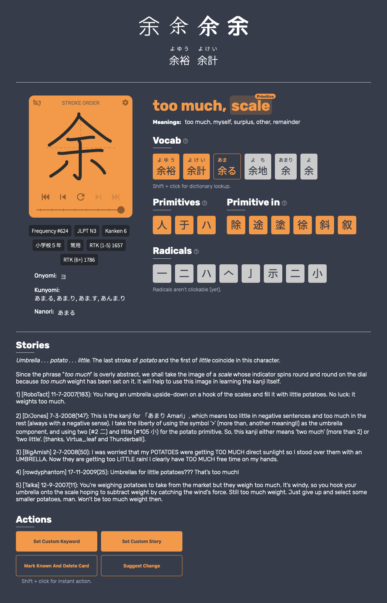
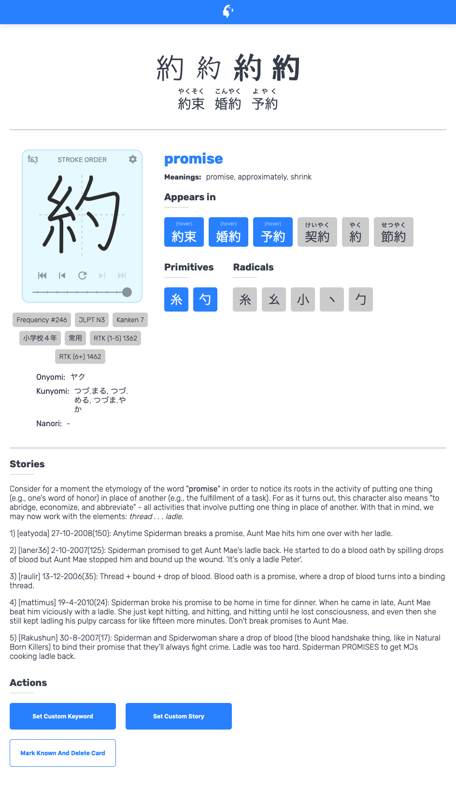

 

<!--  -->

# Migaku Kanji Addon

Customisable Anki addon for learning kanji within the context of the vocab in your Anki collection. Includes kanji metadata (mnemonic stories, component part primitives/radicals), a kanji lookup browser for quick references, and note types for both production (writing) and recognition. And more.

## Contributing

Contributions of all kinds are welcome - please read the contribution guidelines [CONTRIBUTING.md](.github/CONTRIBUTING.md) before submitting any issues or pull requests.

## Development

Before diving into the code, make sure you read the development documentation ([DEVELOPMENT.md](DEVELOPMENT.md)) to learn how this repository is structured.

## License

Migaku Kanji is free and open-source software. The add-on code that runs within Anki is released under the GNU AGPLv3 license, extended by a number of additional terms. For more information please see the LICENSE file that accompanied this program.

This program is distributed in the hope that it will be useful, but WITHOUT ANY WARRANTY.